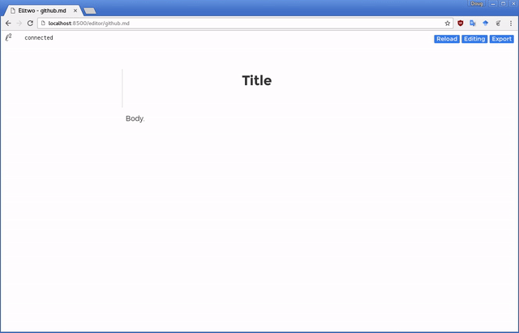

# Elltwo

Elltwo is a simple, browser-based document composition tool. It's geared towards people who, like myself, start developing ideas as snippets of text interspersed with equations. Could very well be useful to others though. The math rendering is taken care of by the wonderful KaTeX library. Notable features include:

- Line-by-line (a la vim) Markdown editing
- Automatic equation and [sub]section numbering
- Equation referencing with popup previews
- Export to Markdown (ish), LaTeX, PDF, and HTML



# Installing

After cloning the repository locally, you'll want to fetch and build the latest version of KaTeX, which is hooked in as a submodule:

```
git submodule init
git submodule update
cd static/katex
npm install
```

Naturally, this requires that you have `nodejs` and `npm` installed.

# Running

From the main directory:

```
python3 editor.py --path=testing
```

Then navigate to:

```
http://localhost:8500/
```

You can set `path` and `port` to wherever you want to store your files. Personally, I have them in a Dropbox folder for peace of mind and portability.
