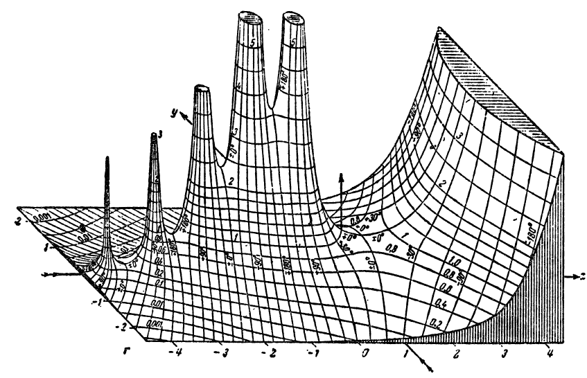

#! Sample $\ell^2$ Document

This is an example of a document written using the $\ell^2$ (ell-two) typesetting system. Basic elements of markdown syntax are supported, as are certain extensions geared toward academic writing. **Click on the logo on the top left for a command cheat sheet.**

# Commands

Here is a list of the keyboard common keyboard commands:

- `up/down`: move active cell
- `w`: edit active cell
- `o`: create new cell after active (and edit)
- `esc`: render cell contents
- `shift+enter`: render cell and create new one (= `esc` then `o`)
- `D`: delete cell
- `C`: copy a cell
- `P`: paste copied cell
- `ctrl+s`: save document

As in the above, unordered lists can be created with consecutive lines in a cell starting with `-`, while ordered lists use `+`.

# Cell Directives

Text cells can be typed in verbatim. Create heading cells by prefacing them with any appropriate number of `#`'s. Image cells must be separate but otherwise use the same syntax as regular markdown: ``

Clicking on a cell, makes it the active cell. One can also move to the previous or next cell with the arrow keys. Creation and deletion of cells can also be accomplished with the mouse hover buttons.

Footnotes can be created with a caret and text in square brackets, as in `^[footnote text]`. Their text will be displayed in a hover over and they will be automatically numbered from 1. For example, this is a footnote ^[The proof is left as an exercise to the reader. 😄]. And here is another ^[And my $\sin(x^2)$ axe! Yes, you can put math in footnotes and even @[eq1] references.].

You can make inline code blocks with ` ` `. Multiline code blocks, similar to multiline equations, can be created by starting and ending a cell with ` `` `, as in:

``
def fib(n):
    if n > 0:
        return n*fib(n-1)
    else:
        return 1

# Math

Math is rendered using KaTeX and supports much of TeX style syntax. It can be displayed inline, as in $x \in \{1,2,\ldots\}$ or in display style

$$ [eq1] \int_0^{\infty} \exp(-x^2)\ dx = \frac{\sqrt{\pi}}{2}

This makes debugging equation errors considerably easier. On top of that, KaTeX now even supports subexpression error display

$$ x^2 = \frac{y^2 + \sqrt{\elm^3}}{2}

Equations can be numbered with semi-arbitrary labels as in `[eq1]`, and referenced similarly with `@[eq1]`, for example @[eq1]. There will be a hover preview of the contents of the referenced equation.

# Tables

One can include tables using standard Markdown syntax. Here is an example

| City | Country | Population (m) | Area (km${}^2$) |
|:---- |:------- |:---------- |:-------------------- |
| Seoul | South Korea | 10 | 605 |
| Tokyo | Japan | 14 | 2,188 |
| Lagos | Nigeria | 16 | 1,171 |
| New York | USA | 8 | 469 |

# Exporting

Documents can be exported to a variety of formats:

+ Markdown (ish): simply the concatenation of all cell inputs
+ HTML: an intermediate language that allows for portable viewing, although uses external javascript libraries
+ LaTeX: naturally we cannot capture all the richness of latex in this environment, but it's a start
+ PDF: auto-compiled version of the previous.
